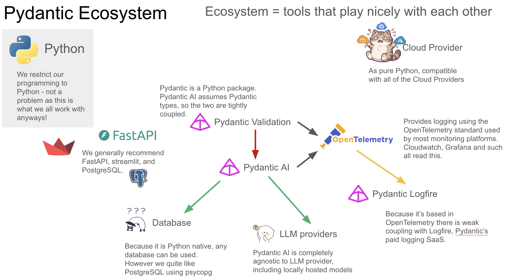

# PydanticAI Course

A hands-on course for learning PydanticAI - the Python agent framework built on Pydantic. This course teaches you how to build, validate, and evaluate AI agents using the Pydantic ecosystem.

## Overview

PydanticAI is an agent framework designed to make it less painful to build production-grade applications with Generative AI. It leans heavily on Pydantic's type safety and validation capabilities to make reliable code.

This course is structured as a series of interactive Jupyter notebooks that progressively introduce key concepts, from basic prerequisites through to production evaluation strategies.

## Course Structure

| Session | Title | Summary |
|---------|-------|---------|
| [Session 0](session_0.ipynb) | Prerequisites | Introduction to `asyncio` for asynchronous programming and Pydantic for data validation - the foundations of PydanticAI |
| [Session 1](session_1.ipynb) | PydanticAI 101 | Core features of PydanticAI including the `Agent` class, model configuration, system prompts, and basic usage patterns |
| [Session 2](session_2.ipynb) | Validation Validation Validation | Output validation using `result_type`, implementing logical guards with `@field_validator`, and understanding the retry loop |
| [Session 3](session_3.ipynb) | Tools, RAG, and Dependency Injection | Connecting agents to the real world with tools and managing dependencies with `deps_type` |
| [Session 4](session_4.ipynb) | Evals & Testing | Building evaluation suites using `pydantic_evals`, including deterministic evaluators, LLM-as-a-Judge, and span-based evaluation |
| [Session 5](session_5.ipynb) | Logging & Monitoring | From ad-hoc Loguru under parallel agent runs to OpenTelemetry, Logfire, and MLflow tracing |

## The Pydantic Ecosystem
PydanticAI pairs well with many other popular tools and frameworks such as PostgreSQL, FastAPI, and Streamlit. It stays agnostic about the things that vary between projects - like cloud provider and logging solution - which makes it a flexible foundation for building agentic applications.
<p align="center">

</p>

## Prerequisites

- Python 3.12+
- Basic understanding of Python programming
- A uv installation
- An OpenAI API key

> **Note:** The commands in this README assume you're on macOS or Linux. They may need adjusting on Windows (WSL is your friend here).

> **Heads up on costs:** The notebooks call the OpenAI API, which uses your API key and will incur charges on your OpenAI account. We default to inexpensive models (e.g. `gpt-5-nano`), so costs should be small, but keep an eye on your [usage dashboard](https://platform.openai.com/usage) to avoid surprises.

## Getting Started

0. **Install uv**
   ```bash
   # macOS/Linux
   curl -LsSf https://astral.sh/uv/install.sh | sh
   ```
   After installation, restart your terminal or run `source ~/.bashrc` (or equivalent) to ensure `uv` is available.

1. **Clone the repository**

   To clone the repository with SSH (recommended):
   ```bash
   git clone git@github.com:facultyai/pydantic-ai-course.git
   cd pydantic-ai-course
   ```

   To clone the repository with HTTPS:
   ```bash
   git clone https://github.com/facultyai/pydantic-ai-course.git
   cd pydantic-ai-course
   ```

2. **Set up your environment**
   ```bash
   # Use uv to manage the virtual environment and dependencies
   uv sync
   ```

3. **Configure your API keys**
   ```bash
   cp env.example .env
   ```
   Then edit `.env` and add your OpenAI API key:
   ```
   OPENAI_API_KEY=sk-proj-abc123...
   OPEN_AI_DEFAULT_MODEL=openai:gpt-5-nano
   ```
   You can get an API key from [platform.openai.com](https://platform.openai.com/api-keys).

## Answer Keys

Sessions 1–3 include an `answers_session_X.ipynb` notebook with completed solutions for reference. Try to work through the exercises yourself before checking the answers!

## Authors
Originally developed by a team at [Faculty AI](https://faculty.ai). See [CONTRIBUTORS.md](CONTRIBUTORS.md).

## Contributing

We welcome contributions that improve the course materials and keep them up-to-date with the latest Pydantic ecosystem developments! Please see [CONTRIBUTING.md](CONTRIBUTING.md) for guidelines, and note our [Code of Conduct](CODE_OF_CONDUCT.md).

## Acknowledgments

Built on the excellent [PydanticAI](https://ai.pydantic.dev/) framework by the Pydantic team.

## Resources
Pydantic Documentation
- [PydanticAI Documentation](https://ai.pydantic.dev/)
- [Pydantic Documentation](https://docs.pydantic.dev/)
- [Pydantic Evals Documentation](https://ai.pydantic.dev/evals/)
- [Logfire Documentation](https://docs.pydantic.dev/logfire/)

Learning Resources
- [OpenAI Talk on Structured Outputs - 40mins](https://www.youtube.com/watch?v=kE4BkATIl9c)
- [Samuel Colvin demonstrating PydanticEvals](https://www.youtube.com/watch?v=zJm5ou6tSxk)
- [asyncio docs - Well written documentation for the library](https://docs.python.org/3/howto/a-conceptual-overview-of-asyncio.html#)
- [voyager - Python library and recommended in memory vector database](https://spotify.github.io/voyager/)
- [annoy - The DEPRECATED precursor to voyager, also by the spotify team](https://github.com/spotify/annoy)
